# 4work – Freelance Marketplace Platform

> **Note:** This project was made as part of DSCC module assignment and does not represent any real company or industry.

---

## 📋 Table of Contents

- [Project Description](#1-project-description)
- [Features List](#2-features-list)
- [Technologies Used](#3-technologies-used)
- [Local Setup Instructions](#4-local-setup-instructions)
- [Deployment Instructions](#5-deployment-instructions)
- [Environment Variables Documentation](#6-environment-variables-documentation)
- [Screenshots](#7-screenshots)
- [Testing](#8-testing)
- [Project Structure](#9-project-structure)

---

## 1. Project Description

**4work** is a full-featured freelance marketplace platform built with Django that connects clients with skilled freelancers. The platform provides a comprehensive solution for project posting, bidding, and management with a focus on user experience and scalability.

### Key Objectives

- **For Clients**: Streamline the process of finding and hiring qualified freelancers for projects
- **For Freelancers**: Provide an intuitive platform to discover work opportunities and showcase skills
- **For Administrators**: Maintain oversight of all platform activities with robust management tools

### Core Functionality

The platform enables two primary user roles:

#### Clients
- Publish detailed project briefs with budgets and deadlines
- Review and manage incoming applications from freelancers
- Accept or reject applications with automated status updates

#### Freelancers
- Create comprehensive skill-based profiles with portfolios
- Browse and filter active projects by category and skills
- Submit detailed applications with cover letters and proposed deadlines
- Track application status and manage ongoing projects

---

## 2. Features List

| Module | Features |
|--------|----------|
| **Authentication & Profiles** | Custom user model (Client/Freelancer roles), secure registration, automatic profile creation, editable profiles (bio, hourly rate, company, avatar), many-to-many skill system |
| **Project Management** | Full CRUD operations, budget & deadline setup, required skills, hierarchical categories, project status tracking (Open / In Progress / Completed), advanced search & filtering |
| **Application Workflow** | Proposal submission with cover letters, client review system, accept/reject functionality, status tracking (Pending / Accepted / Rejected), full application history |
| **Dashboards** | Freelancer dashboard (applications & recommendations), Client dashboard (project & applicant management), dynamic role-based navigation |
| **UI & Architecture** | Responsive design (Bootstrap 5 + Tailwind), reusable components, accessibility-focused UI, Dockerized setup, environment-based configuration, static & media file handling |

---

## 3. Technologies Used

| Layer | Technologies |
|-------|-------------|
| **Backend** | Django 6, Python 3.12+, Gunicorn, psycopg2, python-dotenv |
| **Database & Cache** | PostgreSQL 15 and Redis |
| **Frontend** | HTML5, Bootstrap 5, Tailwind CSS, JavaScript |
| **Testing & Code Quality** | pytest, pytest-django, pytest-cov, factory-boy, black, flake8, isort |
| **Infrastructure** | Docker, Docker Compose, Nginx, Let's Encrypt, GitHub Actions |
| **Hosting** | Azure VM (Ubuntu LTS) |
| **Supporting Libraries** | Pillow, django-cors-headers, whitenoise |

---

## 4. Local Setup Instructions

### Prerequisites

Following tools must be installed before starting the setup:

- **Python 3.12+** 
- **PostgreSQL 14+**
- **Git** 
- **Docker & Docker Compose** (for containerized setup)
- **pip** 

---

#### Step 1: Clone the Repository

```bash
git clone https://github.com/shakhbozmn/4work_16395.git
cd 4work_16395
```

#### Step 2: Configure Environment Variables

```bash
# Copy example environment file
cp .env.example .env

# Edit .env file with appropriate values
nano .env
```

**Required variables for Docker:**

```env
DJANGO_SETTINGS_MODULE=config.settings.development
DEBUG=True
SECRET_KEY=your-secret-key-here

DB_NAME=4work_dev_db
DB_USER=4work_dev_user
DB_PASSWORD=your-secure-password
DB_HOST=db
DB_PORT=5432

REDIS_HOST=redis
REDIS_PORT=6379

ALLOWED_HOSTS=localhost,127.0.0.1,0.0.0.0
SITE_URL=http://localhost:8000
```

#### Step 3: Start Docker Containers

```bash
# Build and start all services
docker compose -f docker-compose.dev.yml up -d --build

# Services started:
# - db: PostgreSQL database
# - redis: Redis cache
# - web: Django application
```

#### Step 4: Run Database Migrations

```bash
# Execute migrations inside the web container
docker compose -f docker-compose.dev.yml exec web python manage.py migrate
```

#### Step 5: Load Demo Data (Optional)

```bash
docker compose -f docker-compose.dev.yml exec web python manage.py load_demo_data
```

#### Step 6: Create Superuser (Optional)

```bash
docker compose -f docker-compose.dev.yml exec web python manage.py createsuperuser
```

#### Step 7: Access the Application

Open your browser and navigate to:
- **Application**: http://localhost:8000
- **Admin Panel**: http://localhost:8000/admin

#### Useful Docker Commands

```bash
# View logs
docker compose -f docker-compose.dev.yml logs -f web

# Stop all services
docker compose -f docker-compose.dev.yml down

# Restart services
docker compose -f docker-compose.dev.yml restart

# Remove all containers and volumes
docker compose -f docker-compose.dev.yml down -v

# Access Django shell
docker compose -f docker-compose.dev.yml exec web python manage.py shell

# Run tests
docker compose -f docker-compose.dev.yml exec web pytest
```

---

### Verification Checklist

After completing the setup, verify:

- Development server starts without errors
- Can access http://localhost:8000
- Database migrations applied successfully
- Redis is running and accessible
- Can create a new user account
- Can log in with created credentials
- Demo data loads (if loaded)
- Admin panel is accessible

---

### Demo Accounts

Load demo data to sign in with ready-made accounts:

| Role | Username | Password |
|------|----------|----------|
| Client | john_client | password123 |
| Freelancer 1 | jane_freelancer | password123 |
| Freelancer 2 | bob_freelancer | password123 |
| Admin | adminus | admin123us |

> Admin credentials grant access to http://localhost:8000/admin.

---

## 5. Deployment Instructions
### Production Deployment Architecture

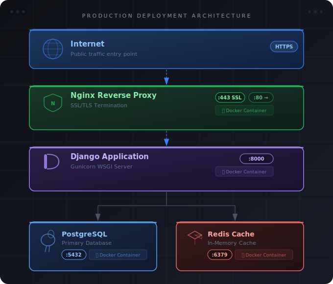

### Deployment Prerequisites

- **Azure VM** (Ubuntu LTS) or similar cloud provider
- **Docker & Docker Compose** installed on server
- **Domain name** configured with DNS records
- **Docker Hub account** for image registry
- **SSH access** to the server
- **GitHub repository** with code

---

### Step-by-Step Deployment Guide

#### Phase 1: Initial Server Setup

##### 1.1 Connect to Server

```bash
ssh azure-user@fourwork.polandcentral.cloudapp.azure.com
```

##### 1.2 Update System and Install Docker

```bash
# Update package list
sudo apt update && sudo apt upgrade -y

# Install Docker
sudo apt install -y docker.io docker-compose-plugin

# Enable and start Docker
sudo systemctl enable docker
sudo systemctl start docker

# Add user to docker group (optional, to avoid sudo)
sudo usermod -aG docker $USER

# Verify installation
docker --version
docker compose version
```

##### 1.3 Create Project Directory

```bash
# Create application directory
sudo mkdir -p /opt/4work
sudo chown $USER:$USER /opt/4work
cd /opt/4work
```

##### 1.4 Clone Repository

```bash
# Clone the repository
git clone https://github.com/shakhbozmn/4work_16395.git .

# Verify files
ls -la
```

##### 1.5 Configure Production Environment

```bash
# Copy production environment template
cp .env.production.example .env.production

# Edit with production values
nano .env.production
```

**Production Environment Variables:**

```env
DJANGO_SETTINGS_MODULE=config.settings.production
DEBUG=False
SECRET_KEY=generate-strong-secret-key

DB_NAME=4work_db
DB_USER=4work_user
DB_PASSWORD=use-strong-random-password
DB_HOST=db
DB_PORT=5432

REDIS_HOST=redis
REDIS_PORT=6379

ALLOWED_HOSTS=fourwork.polandcentral.cloudapp.azure.com,20.215.96.174
SITE_NAME=4work
SITE_URL=https://fourwork.polandcentral.cloudapp.azure.com

CORS_ALLOWED_ORIGINS=https://fourwork.polandcentral.cloudapp.azure.com,http://20.215.96.174
CSRF_TRUSTED_ORIGINS=https://fourwork.polandcentral.cloudapp.azure.com,http://20.215.96.174

DOCKERHUB_USERNAME=dockerhub-username
```

##### 1.6 Generate Secure Secret Key

```bash
# Generate a secure secret key
python -c "from django.core.management.utils import get_random_secret_key; print(get_random_secret_key())"

# Copy the output and use it as SECRET_KEY in .env.production
```

##### 1.7 Set Up SSL Certificates (Let's Encrypt)

```bash
# Install Certbot
sudo apt install -y certbot python3-certbot-nginx

# Obtain SSL certificate
sudo certbot --nginx -d fourwork.polandcentral.cloudapp.azure.com

# Certificates will be automatically configured in Nginx
# Auto-renewal is configured by default
```

##### 1.8 Configure Nginx

```bash
# Verify Nginx configuration
cat nginx/nginx.conf

# Ensure SSL paths are correct
# /etc/letsencrypt/live/your-domain/fullchain.pem
# /etc/letsencrypt/live/your-domain/privkey.pem
```

---

#### Phase 2: Docker Hub Setup

##### 2.1 Create Docker Hub Account

1. Sign up at https://hub.docker.com/
2. Create a repository named `4work`

##### 2.2 Configure GitHub Actions

Create or update `.github/workflows/deploy.yml`:

```yaml
name: Build and Deploy

on:
  push:
    branches: [ main ]

jobs:
  build:
    runs-on: ubuntu-latest
    steps:
      - uses: actions/checkout@v3
      
      - name: Set up Docker Buildx
        uses: docker/setup-buildx-action@v2
      
      - name: Login to Docker Hub
        uses: docker/login-action@v2
        with:
          username: ${{ secrets.DOCKERHUB_USERNAME }}
          password: ${{ secrets.DOCKERHUB_TOKEN }}
      
      - name: Build and push
        uses: docker/build-push-action@v4
        with:
          context: .
          push: true
          tags: ${{ secrets.DOCKERHUB_USERNAME }}/4work:latest
          cache-from: type=registry,ref=${{ secrets.DOCKERHUB_USERNAME }}/4work:buildcache
          cache-to: type=registry,ref=${{ secrets.DOCKERHUB_USERNAME }}/4work:buildcache,mode=max

  deploy:
    needs: build
    runs-on: ubuntu-latest
    steps:
      - name: Deploy to server
        uses: appleboy/ssh-action@master
        with:
          host: ${{ secrets.SERVER_HOST }}
          username: ${{ secrets.SERVER_USER }}
          key: ${{ secrets.SSH_PRIVATE_KEY }}
          script: |
            cd /opt/4work
            ./deploy.sh
```

##### 2.3 Add GitHub Secrets

Add the following secrets in your GitHub repository settings:

- `DOCKERHUB_USERNAME` - Docker Hub username
- `DOCKERHUB_TOKEN` - Docker Hub access token (create in Docker Hub settings)
- `SERVER_HOST` - Server IP or domain
- `SERVER_USER` - SSH username (e.g., azure-user)
- `SSH_PRIVATE_KEY` - SSH private key

---

#### Phase 3: Initial Deployment

##### 3.1 Start Database and Redis Containers

```bash
# Start PostgreSQL and Redis first
docker compose up -d db redis

# Wait for database to be ready
docker compose logs -f db
# Press Ctrl+C when you see "database system is ready to accept connections"

# Verify Redis is running
docker compose logs redis
```

##### 3.2 Run Migrations

```bash
# Build and start web container
docker compose up -d web

# Run migrations
docker compose exec web python manage.py migrate

# Collect static files
docker compose exec web python manage.py collectstatic --noinput
```

##### 3.3 Start Nginx

```bash
# Start Nginx reverse proxy
docker compose up -d nginx

# Check all containers
docker compose ps
```

##### 3.4 Create Superuser

```bash
# Create admin user
docker compose exec web python manage.py createsuperuser
```

##### 3.5 Verify Deployment

```bash
# Check application logs
docker compose logs -f web

# Check Nginx logs
docker compose logs -f nginx

# Test health endpoint
curl http://localhost/health/
```

---

#### Phase 4: Automated Deployment (CI/CD)

The deployment is fully automated via GitHub Actions with a comprehensive CI/CD pipeline. When code is pushed to the `main` branch, the following pipeline executes:

---

#### CI/CD Pipeline Flow

**Trigger:** Pushed to `main` branch.

#### Stage 1: Trigger & Preparation
* **Trigger:** GitHub webhook activates on push.
* **Workflow:** `.github/workflows/deploy.yml`
* **Environment:** GitHub-hosted Ubuntu Latest.
* **Action:** Checkout repository code.

#### Stage 2: Continuous Integration (CI)
* **2.1 Code Quality:** Validate with `flake8` (linting), `black` (formatting), and `isort` (imports).
* **2.2 Unit Testing:** Run `pytest` with a test DB. Fails if any test breaks or coverage drops below 80%.
* **2.3 Security Scanning:** Scan Dockerfile, check for exposed secrets, and validate dependencies (CVEs).

#### Stage 3: Continuous Delivery (CD) - Build
* **3.1 Setup:** Initialize Docker Buildx and load cached layers.
* **3.2 Build:** Build image using production settings. Tag as `latest` and `<git-sha>`.
* **3.3 Authenticate:** Login to Docker Hub using stored secrets.
* **3.4 Push:** Push image and build cache to Docker Hub registry.

#### Stage 4: Server Deployment (deploy.sh)
* **4.1 Secure Connection:** SSH into the production server using secrets.
* **4.2 Execution Steps:**
  1. **Pull Code:** `git pull origin main` in `/opt/4work`
  2. **Pull Image:** `docker compose pull web`
  3. **Verify Dependencies:** Ensure `db`, `redis`, and `nginx` are running (zero downtime).
  4. **Redeploy Web:** `docker compose up -d --no-deps --force-recreate web`
  5. **Migrate:** Apply pending DB changes (`python manage.py migrate`).
  6. **Static Files:** Gather files for Nginx (`python manage.py collectstatic`).
  7. **Health Check:** Wait 10 seconds, verify container is healthy.
  8. **Logs:** Display the last 50 lines of deployment logs.

#### Stage 5: Post-Deployment Verification
* **5.1 Health Checks:** HTTP GET to `/health/`, check DB and Redis connectivity.
* **5.2 Smoke Tests:** Verify home page, user authentication, and static file delivery.
* **5.3 Notifications:** Send success/failure alerts and update repo status.

#### Pipeline Failure Handling

If any stage fails:

1. **CI Stage Failure**: Pipeline stops immediately, notified via GitHub
2. **Build Failure**: No image is pushed to Docker Hub, deployment is aborted
3. **Deploy Failure**: Old container continues running, rollback is automatic

---

### Manual Deployment Script

The [`deploy.sh`](deploy.sh:1) script performs the server-side deployment steps:

```bash
#!/bin/bash
# 4work Zero-Downtime Deployment Script

set -e  # Exit on any error

echo "=== Starting Deployment ==="

# 1. Pull latest code
echo "[1/8] Pulling latest code from repository..."
git pull origin main

# 2. Pull latest Docker image
echo "[2/8] Pulling latest Docker image from Docker Hub..."
docker compose pull web

# 3. Ensure db, redis, and nginx are running (no downtime)
echo "[3/8] Ensuring supporting services are running..."
docker compose up -d db redis nginx

# 4. Redeploy web service (zero downtime)
echo "[4/8] Redeploying web service with new image..."
docker compose up -d --no-deps --force-recreate web

# 5. Run database migrations
echo "[5/8] Running database migrations..."
docker compose exec -T web python manage.py migrate --noinput

# 6. Collect static files
echo "[6/8] Collecting static files..."
docker compose exec -T web python manage.py collectstatic --noinput

# 7. Wait for health check
echo "[7/8] Waiting for application to start..."
sleep 10

# 8. Show container status and logs
echo "[8/8] Deployment complete! Container status:"
docker compose ps

echo ""
echo "=== Recent Application Logs ==="
docker logs --tail 50 4work_app

echo ""
echo "=== Deployment Successful ==="
```

---

### Manual Deployment Commands

```bash
# Navigate to project directory
cd /opt/4work

# Run deployment script
./deploy.sh
```

---

### GitHub Secrets Required

Configure these secrets in your GitHub repository settings (Settings → Secrets and variables → Actions):

| Secret Name | Description | Example |
|-------------|-------------|---------|
| `DOCKERHUB_USERNAME` | Docker Hub username | `shakhbozmn` |
| `DOCKERHUB_TOKEN` | Docker Hub access token | Generated in Docker Hub Account Settings → Security → New Access Token |
| `SERVER_HOST` | Production server hostname/IP | `fourwork.polandcentral.cloudapp.azure.com` |
| `SERVER_USER` | SSH username on server | `azure-user` |
| `SSH_PRIVATE_KEY` | Private SSH key for server access | Contents of `~/.ssh/id_rsa` (or your private key file) |

---

### Creating Docker Hub Access Token

1. Log in to https://hub.docker.com/
2. Go to Account Settings → Security
3. Click "New Access Token"
4. Enter a description (e.g., "GitHub Actions")
5. Select permissions: Read, Write, Delete
6. Copy the generated token
7. Add it as `DOCKERHUB_TOKEN` in GitHub secrets

---

### CI/CD Best Practices Implemented

| Practice | Implementation |
|----------|----------------|
| **Zero Downtime Deployment** | Nginx and old container continue serving until new container is healthy |
| **Rollback Capability** | Old image remains in Docker Hub, can be redeployed with `docker compose pull web:<tag>` |
| **Build Caching** | Docker layer caching reduces build time by ~70% |
| **Automated Testing** | All tests must pass before deployment |
| **Security Scanning** | Dependencies and Dockerfile scanned for vulnerabilities |
| **Immutable Infrastructure** | New containers replace old ones, no in-place updates |
| **Health Checks** | Application health verified before marking deployment successful |
| **Audit Trail** | Git SHA tags enable tracking of deployed commits |

---

### Production Operations

#### Monitoring

```bash
# View all container status
docker compose ps

# View real-time logs
docker compose logs -f

# View specific service logs
docker compose logs -f web
docker compose logs -f nginx
docker compose logs -f db
docker compose logs -f redis

# View recent logs
docker compose logs --tail 100 web
```

#### Maintenance

```bash
# Restart specific service
docker compose restart web

# Restart all services
docker compose restart

# Update application
git pull origin main
docker compose pull web
docker compose up -d --no-deps --force-recreate web

# Run migrations after update
docker compose exec web python manage.py migrate

# Collect static files after update
docker compose exec web python manage.py collectstatic --noinput
```

#### Backup

```bash
# Backup database
docker compose exec db pg_dump -U 4work_user 4work_db > backup_$(date +%Y%m%d_%H%M%S).sql

# Backup media files
tar -czf media_backup_$(date +%Y%m%d_%H%M%S).tar.gz media/

# Backup Redis data
docker compose exec redis redis-cli BGSAVE
docker compose cp 4work_redis:/data/dump.rdb redis_backup_$(date +%Y%m%d_%H%M%S).rdb

# Restore database
cat backup_20240101_120000.sql | docker compose exec -T db psql -U 4work_user 4work_db

# Restore Redis data
docker compose cp redis_backup_20240101_120000.rdb 4work_redis:/data/dump.rdb
docker compose restart redis
```

#### Troubleshooting

```bash
# Check container health
docker inspect 4work_app | grep -A 10 Health

# Restart unhealthy containers
docker compose restart

# View container resource usage
docker stats

# Access container shell
docker compose exec web bash

# Check Nginx configuration
docker compose exec nginx nginx -t

# Test database connection
docker compose exec web python manage.py dbshell
```

**Accessing via Public IP vs Domain Name**

The application is accessible via both:
- **Domain (HTTPS)**: `https://fourwork.polandcentral.cloudapp.azure.com` - Recommended for production
- **Public IP (HTTP)**: `http://20.215.96.174` - For testing purposes

**Why IP access shows 400 Bad Request:**
- Django's `ALLOWED_HOSTS` must include both the domain and IP address
- Nginx `server_name` must accept both domain and IP
- SSL certificates are issued for domain names only, not IP addresses

**To enable IP access, ensure:**
1. `ALLOWED_HOSTS` in `.env.production` includes: `fourwork.polandcentral.cloudapp.azure.com,20.215.96.174`
2. `CSRF_TRUSTED_ORIGINS` includes: `https://fourwork.polandcentral.cloudapp.azure.com,http://20.215.96.174`
3. Nginx configuration accepts both domain and IP

**After updating configuration:**
```bash
# Restart web container to apply environment changes
docker compose up -d --no-deps --force-recreate web

# Reload Nginx configuration
docker compose exec nginx nginx -s reload
```

---

## 6. Environment Variables Documentation

### Development Environment Variables ([`.env.example`](.env.example:1))

| Variable | Type | Description | Example | Required |
|----------|------|-------------|---------|----------|
| `DJANGO_SETTINGS_MODULE` | String | Django settings module path | `config.settings.development` | Yes |
| `DEBUG` | Boolean | Enable Django debug mode | `True` | Yes |
| `SECRET_KEY` | String | Cryptographic signing key | `django-insecure-dev-key-change-in-production` | Yes |
| `DB_NAME` | String | PostgreSQL database name | `4work_dev_db` | Yes |
| `DB_USER` | String | Database username | `4work_dev_user` | Yes |
| `DB_PASSWORD` | String | Database password | `your-db-password` | Yes |
| `DB_HOST` | String | Database host address | `db` (Docker) or `localhost` | Yes |
| `DB_PORT` | Integer | Database port | `5432` | No (default: 5432) |
| `REDIS_HOST` | String | Redis cache host address | `redis` | No (default: redis) |
| `REDIS_PORT` | Integer | Redis cache port | `6379` | No (default: 6379) |
| `ALLOWED_HOSTS` | String | Comma-separated allowed hosts | `localhost,127.0.0.1,0.0.0.0` | Yes |
| `SITE_NAME` | String | Site name for emails/templates | `4work` | No |
| `SITE_URL` | String | Base URL of the site | `http://localhost:8000` | Yes |
| `CORS_ALLOWED_ORIGINS` | String | Comma-separated CORS origins | `http://localhost` | No |
| `CSRF_TRUSTED_ORIGINS` | String | Comma-separated CSRF origins | `http://localhost` | No |
| `DOCKERHUB_USERNAME` | String | Docker Hub username | `your-dockerhub-username` | No |

### Production Environment Variables ([`.env.production.example`](.env.production.example:1))

| Variable | Type | Description | Example | Required |
|----------|------|-------------|---------|----------|
| `DJANGO_SETTINGS_MODULE` | String | Django settings module path | `config.settings.production` | Yes |
| `DEBUG` | Boolean | Enable Django debug mode | `False` | Yes |
| `SECRET_KEY` | String | Cryptographic signing key | `generate-with-openssl-rand-base64-50` | Yes |
| `DB_NAME` | String | PostgreSQL database name | `4work_db` | Yes |
| `DB_USER` | String | Database username | `4work_user` | Yes |
| `DB_PASSWORD` | String | Database password | `use-a-strong-random-password` | Yes |
| `DB_HOST` | String | Database host address | `db` | Yes |
| `DB_PORT` | Integer | Database port | `5432` | No |
| `REDIS_HOST` | String | Redis cache host address | `redis` | No (default: redis) |
| `REDIS_PORT` | Integer | Redis cache port | `6379` | No (default: 6379) |
| `ALLOWED_HOSTS` | String | Comma-separated allowed hosts (domain + IP) | `fourwork.polandcentral.cloudapp.azure.com,20.215.96.174` | Yes |
| `SITE_NAME` | String | Site name for emails/templates | `4work` | No |
| `SITE_URL` | String | Base URL of the site (use domain for production) | `https://fourwork.polandcentral.cloudapp.azure.com` | Yes |
| `CORS_ALLOWED_ORIGINS` | String | Comma-separated CORS origins (domain + IP) | `https://fourwork.polandcentral.cloudapp.azure.com,http://20.215.96.174` | No |
| `CSRF_TRUSTED_ORIGINS` | String | Comma-separated CSRF origins (domain + IP) | `https://fourwork.polandcentral.cloudapp.azure.com,http://20.215.96.174` | Yes |
| `DOCKERHUB_USERNAME` | String | Docker Hub username | `your-dockerhub-username` | Yes |

## 7. Screenshots

All screenshots are captured from the live production deployment at **https://fourwork.polandcentral.cloudapp.azure.com**

### Home Page

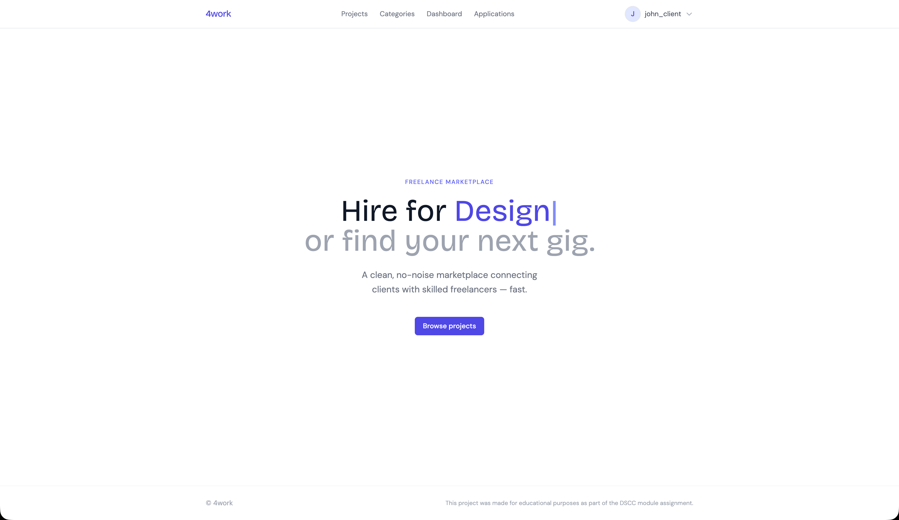

---

### Project Listings

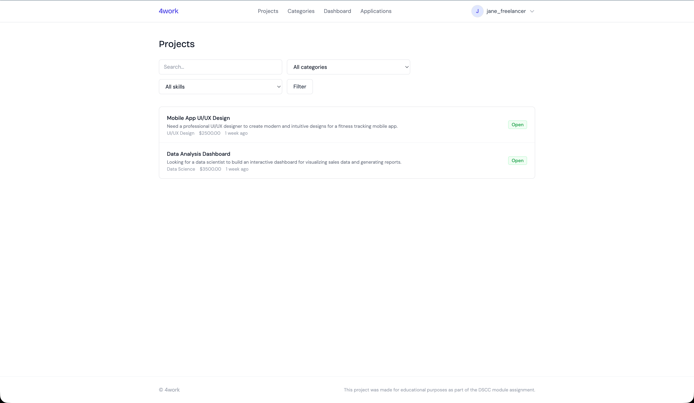

---

### Project Detail (Client vs Freelancer)

<table>
  <tr>
    <td align="center">
      <strong>Client</strong><br/>
      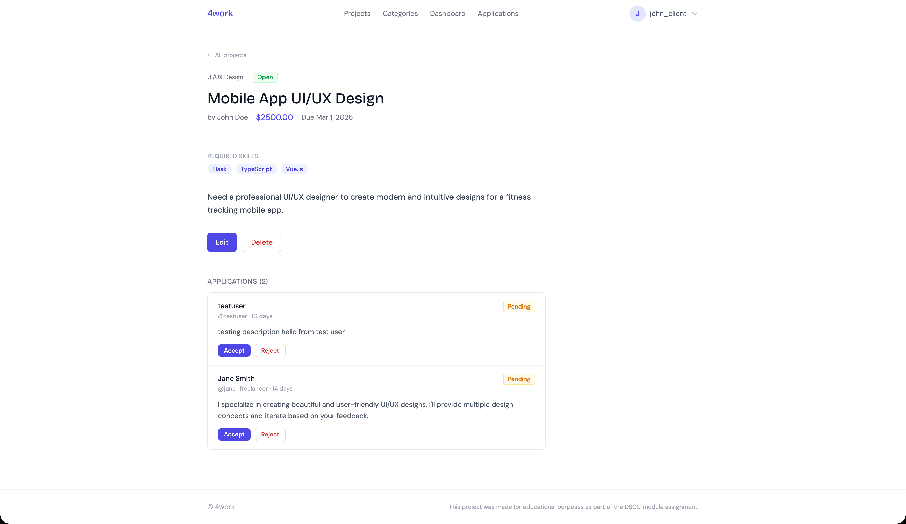
    </td>
    <td align="center">
      <strong>Freelancer</strong><br/>
      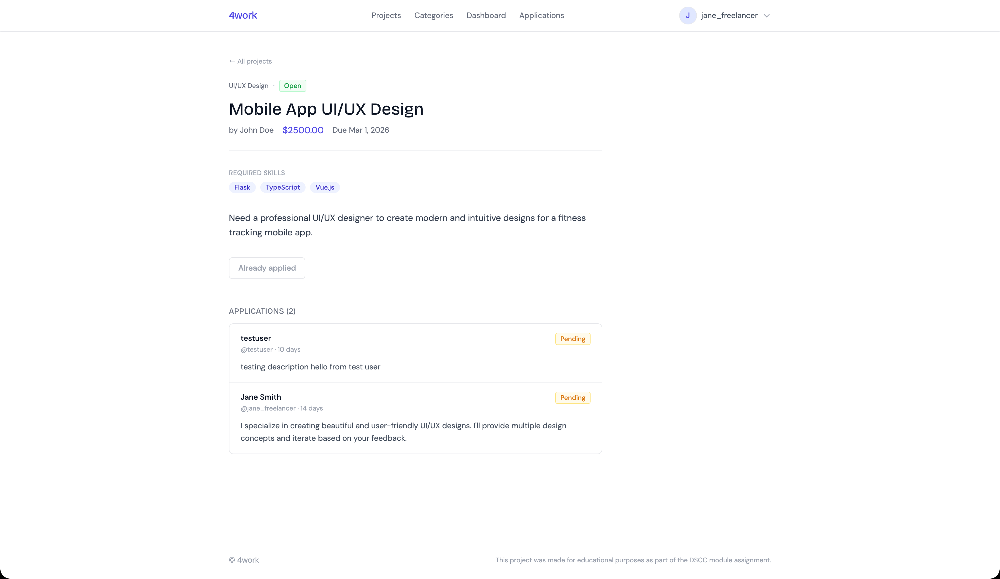
   </td>
  </tr>
</table>

---


### Dashboard (Client vs Freelancer)

<table>
  <tr>
    <td align="center">
      <strong>Client</strong><br/>
      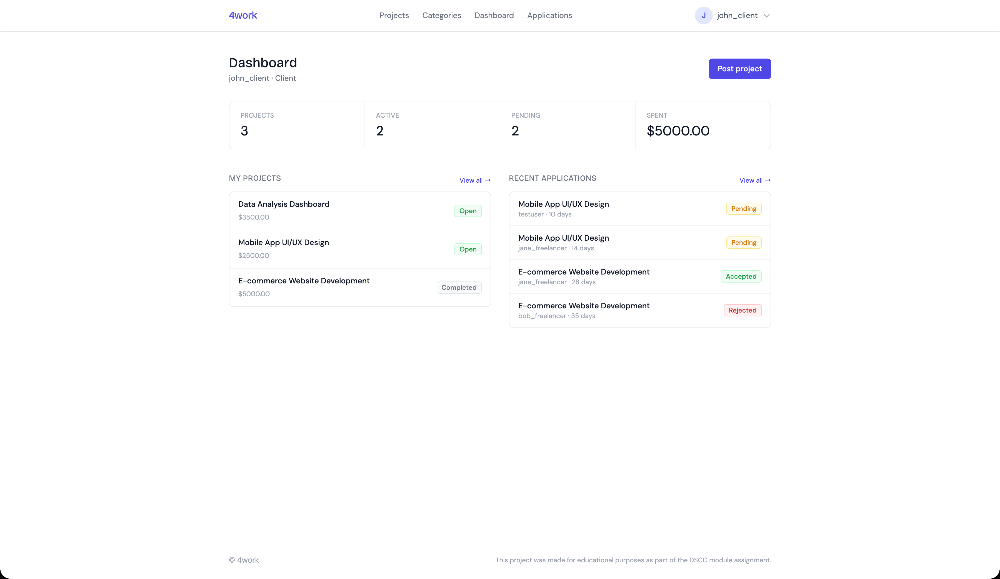
    </td>
    <td align="center">
     <strong>Freelancer</strong><br/>
      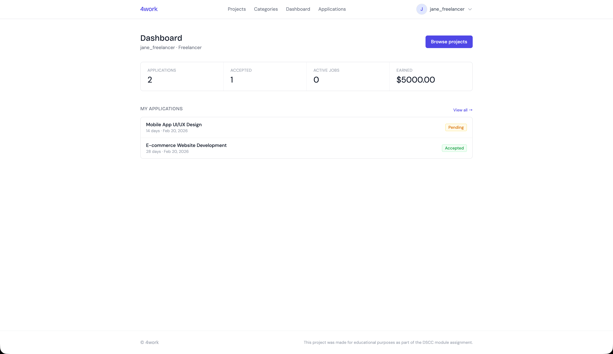
    </td>
  </tr>
</table>

---

### Authentication (Register and Login)

<table>
  <tr>
    <td align="center">
      <strong>Register</strong><br/>
      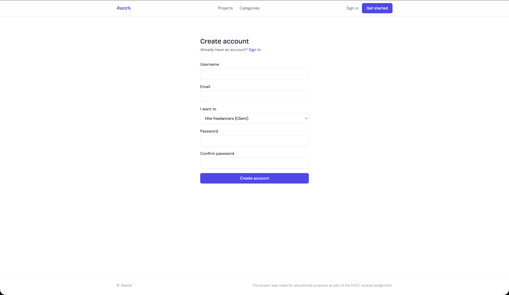
    </td>
    <td align="center">
     <strong>Login</strong><br/>
      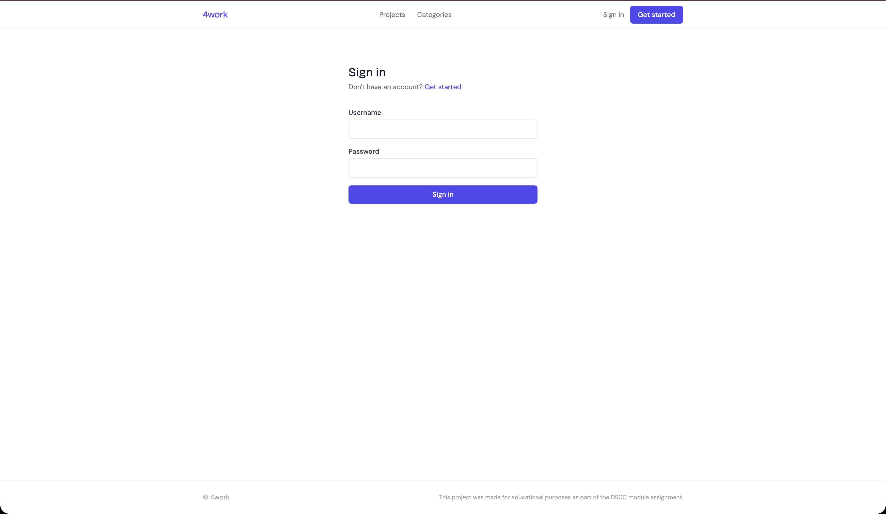
    </td>
  </tr>
</table>

---

### Profile Page (The same layout for both client and freelancer)

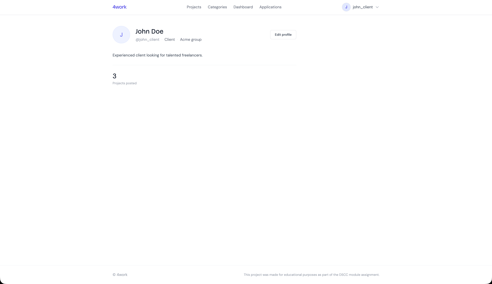

---

### Profile Update (Client vs Freelancer)

<table>
  <tr>
    <td align="center">
      <strong>Client</strong><br/>
      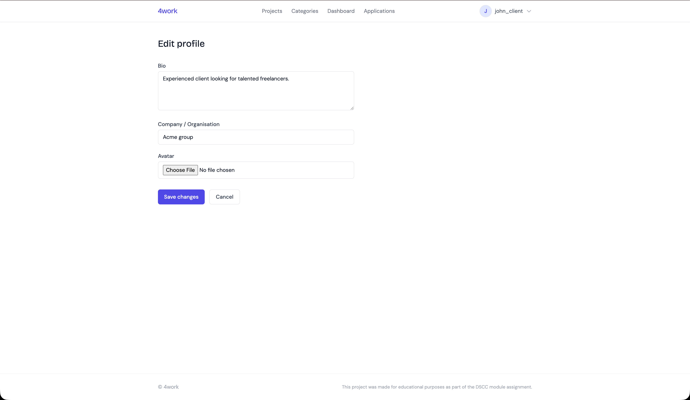
    </td>
    <td align="center">
     <strong>Freelancer</strong><br/>
      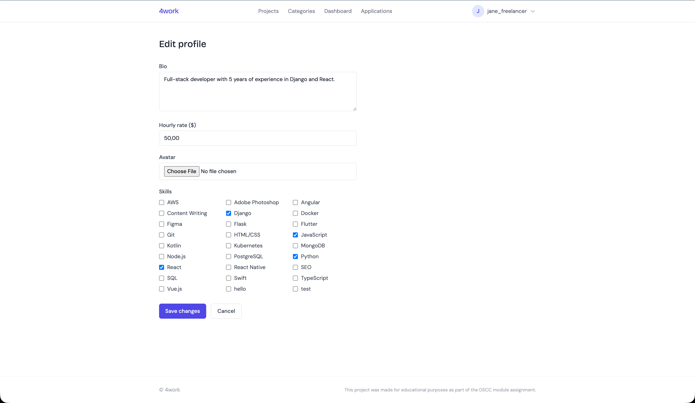
    </td>
  </tr>
</table>

---


### Category Listing

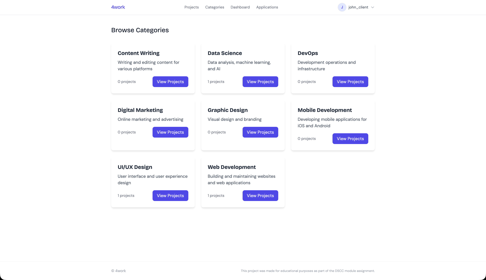

---


### Application List (Client vs Freelancer)

<table>
  <tr>
    <td align="center">
      <strong>Client</strong><br/>
      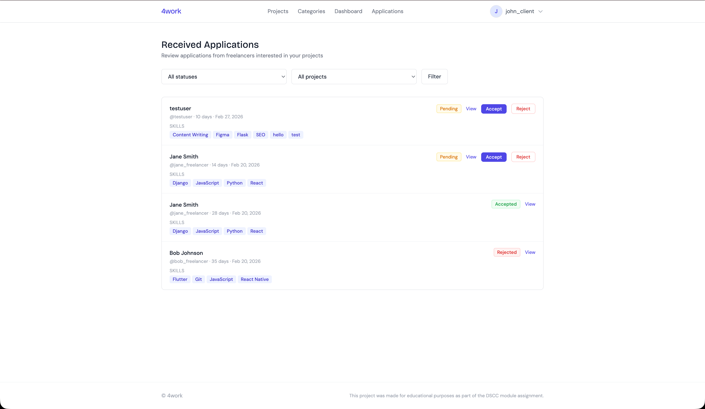
    </td>
    <td align="center">
     <strong>Freelancer</strong><br/>
      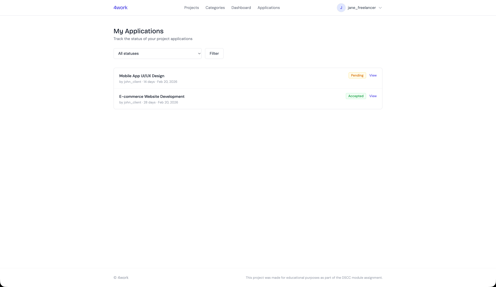
    </td>
  </tr>
</table>

---

## 8. Testing

### Running Tests

The project includes comprehensive test suites for both the [`accounts`](accounts/tests/) and [`marketplace`](marketplace/tests/) apps.

```bash
# Run all tests
pytest

# Run tests with verbose output
pytest -vv

# Run tests for specific app
pytest accounts/
pytest marketplace/

# Run specific test file
pytest accounts/tests/test_models.py

# Run specific test function
pytest accounts/tests/test_models.py::test_user_creation

# Run tests with coverage report
pytest --cov=accounts --cov=marketplace --cov-report=html

# Run tests and show coverage in terminal
pytest --cov=accounts --cov=marketplace --cov-report=term-missing
```

### Test Structure

```
accounts/tests/
├── test_models.py      # User and Profile model tests
└── test_views.py       # Authentication and profile view tests

marketplace/tests/
├── test_models.py      # Project, Application, Category model tests
└── test_views.py       # Project and application view tests
```

### Test Coverage

The project maintains high test coverage across all critical functionality:

- **User authentication and authorization**
- **Profile creation and management**
- **Project CRUD operations**
- **Application workflow**
- **Search and filtering**
- **Form validation**

### Writing Tests

Example test structure:

```python
import pytest
from django.contrib.auth import get_user_model
from accounts.models import Profile

User = get_user_model()

@pytest.mark.django_db
def test_user_creation():
    user = User.objects.create_user(
        username='testuser',
        email='test@example.com',
        password='testpass123',
        role='freelancer'
    )
    assert user.username == 'testuser'
    assert user.role == 'freelancer'
    assert Profile.objects.filter(user=user).exists()
```

### Test Fixtures

The project uses [`factory-boy`](requirements.txt:16) for test data generation:

```python
import pytest
from accounts.factories import UserFactory, ProfileFactory

@pytest.mark.django_db
def test_with_factory():
    user = UserFactory(role='freelancer')
    profile = ProfileFactory(user=user)
    assert user.profile == profile
```

---

## 9. Project Structure

```
4work_16395/
├── .dockerignore                    # Docker ignore patterns
├── .env.example                     # Development environment template
├── .env.production.example          # Production environment template
├── .gitignore                       # Git ignore patterns
├── 4work_ERD.drawio                # Entity Relationship Diagram
├── deploy.sh                        # Zero-downtime deployment script
├── docker-compose.yml               # Production Docker Compose configuration
├── docker-compose.dev.yml           # Development Docker Compose configuration
├── Dockerfile                       # Production Docker image
├── Dockerfile.dev                   # Development Docker image
├── entrypoint.sh                    # Container entrypoint script
├── manage.py                        # Django management script
├── pytest.ini                       # Pytest configuration
├── requirements.txt                 # Python dependencies
├── README.md                        # This file
│
├── accounts/                        # User accounts and profiles app
│   ├── __init__.py
│   ├── admin.py                     # Django admin configuration
│   ├── apps.py                      # App configuration
│   ├── forms.py                     # User and profile forms
│   ├── models.py                    # User and Profile models
│   ├── signals.py                   # Post-save signals
│   ├── urls.py                      # URL patterns
│   ├── views.py                     # View functions
│   ├── management/
│   │   └── commands/
│   │       └── load_demo_data.py    # Demo data loader command
│   ├── migrations/                  # Database migrations
│   └── tests/                       # Test suite
│       ├── test_models.py
│       └── test_views.py
│
├── marketplace/                     # Projects and applications app
│   ├── __init__.py
│   ├── admin.py                     # Django admin configuration
│   ├── apps.py                      # App configuration
│   ├── forms.py                     # Project and application forms
│   ├── models.py                    # Project, Application, Category models
│   ├── urls.py                      # URL patterns
│   ├── views.py                     # View functions
│   ├── migrations/                  # Database migrations
│   └── tests/                       # Test suite
│       ├── test_models.py
│       └── test_views.py
│
├── config/                          # Django project configuration
│   ├── __init__.py
│   ├── asgi.py                      # ASGI configuration
│   ├── gunicorn.py                  # Gunicorn configuration
│   ├── urls.py                      # Root URL configuration
│   ├── views.py                     # Root views
│   ├── wsgi.py                      # WSGI configuration
│   └── settings/                    # Settings modules
│       ├── __init__.py
│       ├── base.py                  # Base settings
│       ├── development.py           # Development settings
│       ├── production.py            # Production settings
│       └── test.py                  # Test settings
│
├── fixtures/                        # Demo data fixtures
│   ├── categories.json              # Project categories
│   ├── demo_data.json               # Complete demo data
│   └── skills.json                  # Skills list
│
├── nginx/                           # Nginx configuration
│   ├── Dockerfile                   # Nginx Docker image
│   ├── nginx.conf                   # Nginx configuration
│   └── acme/                        # ACME challenge directory
│       └── .gitkeep
│
├── static/                          # Static files (collected to staticfiles/)
├── media/                           # User-uploaded media files
│
├── templates/                       # Django templates
│   ├── base.html                    # Base template with common layout
│   ├── home.html                    # Home page
│   ├── accounts/                   # Account-related templates
│   │   ├── profile_detail.html
│   │   └── profile_update.html
│   ├── auth/                        # Authentication templates
│   │   ├── login.html
│   │   └── register.html
│   ├── components/                  # Reusable components
│   │   ├── alert.html
│   │   ├── button.html
│   │   ├── card.html
│   │   ├── footer.html
│   │   ├── modal.html
│   │   ├── navbar.html
│   │   ├── pagination.html
│   │   └── search_form.html
│   ├── dashboard/                   # Dashboard templates
│   │   ├── client_dashboard.html
│   │   └── freelancer_dashboard.html
│   └── marketplace/                 # Marketplace templates
│       ├── application_form.html
│       ├── application_list.html
│       ├── category_detail.html
│       ├── category_list.html
│       ├── project_confirm_delete.html
│       ├── project_detail.html
│       ├── project_form.html
│       ├── project_list.html
│       └── skill_list.html
│
└── .github/                         # GitHub configuration
    └── workflows/                   # CI/CD workflows
        └── deploy.yml               # Deployment workflow
```

### Key Directories Explained

- **[`accounts/`](accounts/)**: Handles user authentication, profiles, and user management
- **[`marketplace/`](marketplace/)**: Core business logic for projects, applications, and categories
- **[`config/`](config/)**: Django project configuration with environment-specific settings
- **[`templates/`](templates/)**: All HTML templates organized by functionality
- **[`fixtures/`](fixtures/)**: JSON fixtures for demo data and initial setup
- **[`nginx/`](nginx/)**: Nginx reverse proxy configuration for production 

> **Additional Notes:**
- ACME challenge directory is used for Let's Encrypt SSL certificate validation as renewal is automated.

---

## 📝 License

This project was created as part of a DSCC module assignment. It does not represent any real company or industry.

---

**Live Demo**: https://fourwork.polandcentral.cloudapp.azure.com

**Repository**: https://github.com/shakhbozmn/4work_16395
